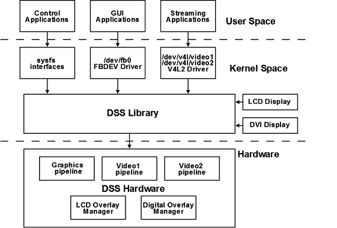
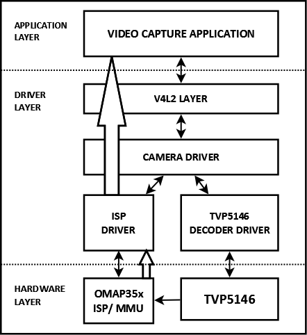

# Video KB & BKM

Video Knowledge Base and Best Known Method ...

## Video Display Driver

### Architecture

> https://processors.wiki.ti.com/index.php?oldid=218088

### Driver Features

## Video Capture Driver

> https://processors.wiki.ti.com/index.php?oldid=218088

## Android Display Sub-system

> https://processors.wiki.ti.com/index.php/TI-Android-GingerBread-2.3.4-DevKit-2.1_PortingGuides#Display

## Reference

- https://www.slideserve.com/taffy/android-multimedia-overview

